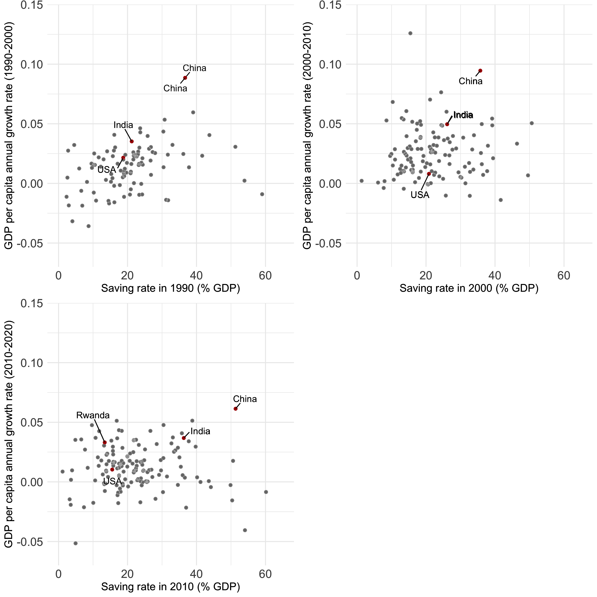
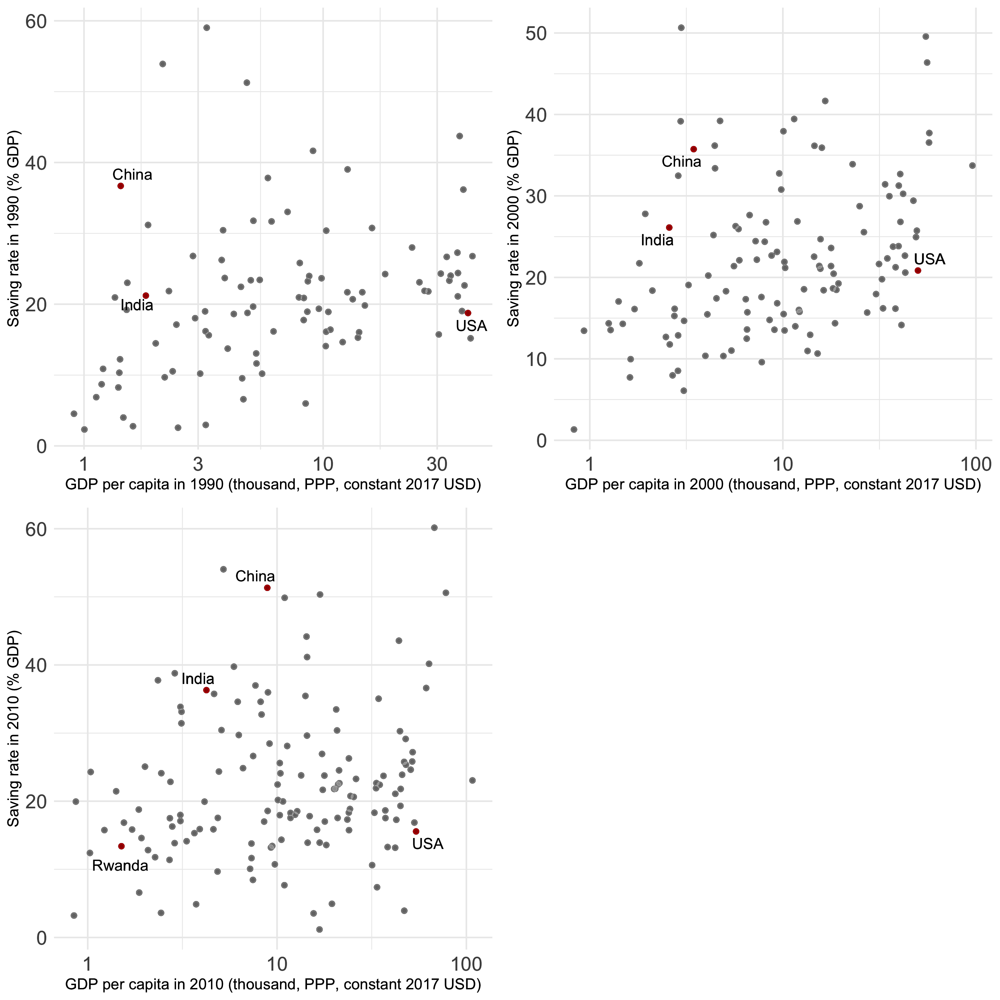

```{r setup, include=FALSE}
knitr::opts_chunk$set(echo = TRUE)
```

```{r ScatterLabels, warning = FALSE, results = "hide"}
# Install and load packages ---------------
packages <- c(
  "tidyverse",
  "ggrepel",
  "WDI",
  "forcats",
  "grid",
  "gridExtra",
  "countrycode",
  "scales"
)

# Change to install = TRUE to install the required packages
pacman::p_load(packages, character.only = TRUE)

# Load an example dataset ---------------
gdp_data <- WDI(indicator = "NY.GDP.PCAP.PP.KD", start = 1990, end = 2020)
saving_data <- WDI(indicator = "NY.GNS.ICTR.ZS", start = 1990, end = 2020)
# country_code <- as_tibble(WDI_data$country)
country_code <- codelist %>% 
  drop_na(un.name.en) %>% 
  select(iso2c)

data <- gdp_data %>% 
  drop_na(iso2c) %>% 
  left_join(
    saving_data %>% 
      select(-country) %>% 
      drop_na(iso2c),
      by = c("iso2c", "year")
  ) %>% 
  rename(
    gdp = NY.GDP.PCAP.PP.KD,
    saving_rate = NY.GNS.ICTR.ZS
    ) %>%
  inner_join(country_code, by = c("iso2c")) %>%
  filter(year %in% c(1990, 2000, 2010, 2020)) %>% 
  arrange(iso2c, year) %>% 
  group_by(iso2c) %>% 
  mutate(growth_rate = (1 / 10) * log(lead(gdp) / gdp)) %>% 
  drop_na(growth_rate, saving_rate) %>% 
  mutate(country = ifelse(country == "United States", "USA", country)) %>% 
  filter(saving_rate >= 0 & saving_rate <= 65)

year_list <- c(1990, 2000, 2010)
country_stress <- c("IN", "CN", "US", "RW")

```

## Saving rate and GDP growth rate

```{r}

plot_list <- map(
  year_list,
  ~ ggplot(
    data %>% filter(year == .x), 
    aes(x = saving_rate, y = growth_rate)
    ) +
    geom_point() +
    geom_point(aes(alpha = 0.8, color = (iso2c %in% country_stress)), show.legend = FALSE) +
    geom_text_repel(
      aes(label = ifelse(iso2c %in% country_stress, country, "")),
      box.padding = 0.5,
      max.overlaps = Inf
      ) +
    xlab(str_interp("Saving rate in ${.x} (% GDP)")) +
    ylab(str_interp("GDP per capita annual growth rate (${.x}-${.x + 10})")) +
    ylim(c(-0.06, 0.14)) +
    xlim(c(0, 65)) +
    scale_color_manual(values = c("gray", "red")) +
    theme_minimal() +
    theme(
      axis.text = element_text(size = 14),
      axis.title = element_text(size = 13)
    ) 
)

ggsave(
  filename = "figure/saving_growth.png",
  plot = grid.arrange(
    arrangeGrob(
      grobs = plot_list, 
      ncol = 2,
      )
    ),
  height = 10.0,
  width = 10.0
  )

```

```{r}

```

## Saving rate and GDP per capita

```{r}

plot_list <- map(
  year_list,
  ~ ggplot(data %>% filter(year == .x), aes(x = gdp / (10^3), y = saving_rate)) +
    geom_point() +
    geom_point(aes(alpha = 0.8, color = (iso2c %in% country_stress)), show.legend = FALSE) +
    geom_text_repel(aes(label = ifelse(iso2c %in% country_stress, country, "")), max.overlaps = Inf) +
    scale_x_log10() +
    xlab(str_interp("GDP per capita in ${.x} (thousand, PPP, constant 2017 USD)")) +
    ylab(str_interp("Saving rate in ${.x} (% GDP)")) +
    scale_color_manual(values = c("gray", "red")) +
    theme_minimal() +
    theme(
      axis.text = element_text(size = 14),
      axis.title = element_text(size = 11)
    ) 
)

ggsave(
  filename = "figure/saving_gdp.png",
  plot = grid.arrange(
  arrangeGrob(
    grobs = plot_list, 
    ncol = 2,
    )
  ),
  height = 10.0,
  width = 10.0
  )

```

```{r}

```